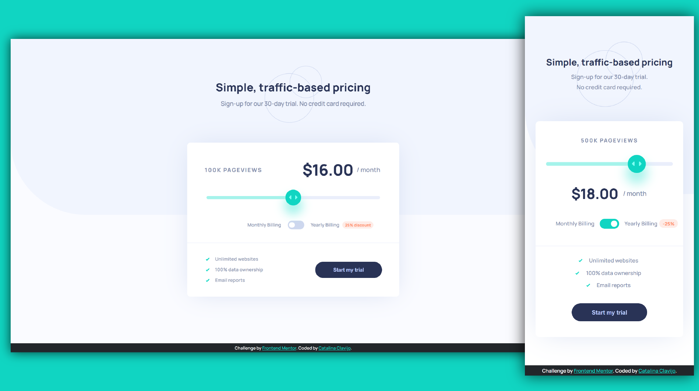

# Frontend Mentor - Interactive pricing component

This is a solution to the [Interactive pricing component challenge on Frontend Mentor](https://www.frontendmentor.io/challenges/interactive-pricing-component-t0m8PIyY8).

## Screenshot

### Links

- Live Site URL: [https://cataclas.github.io/Frontend-Mentor_Interactive-pricing-component/](https://cataclas.github.io/Frontend-Mentor_Interactive-pricing-component/)

## Built with

- Semantic HTML5 markup
- [CSS custom properties](https://devdocs.io/css/)
- [@media](https://devdocs.io/css/@media)
- [jQuery](https://jquery.com/download/)
 

## Author

- Frontend Mentor - [@Cataclas](https://www.frontendmentor.io/profile/Cataclas)
